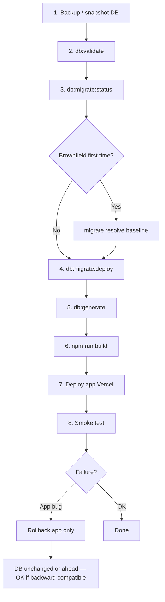

# Deployment Runbook — Database & Application

> Cập nhật: 2026-08-06 (WP1)  
> **Migration production: thủ công** — không auto trong Vercel build.

---

## Prerequisites

- `DATABASE_URL` trỏ đúng environment
- `SESSION_SECRET` (production) — xem WP0-A changelog
- Neon/console access cho backup
- Branch code đã có WP1 migrations committed

---

## Deploy flow (recommended order)



---

## Step-by-step

### 1. Backup database

Neon: create branch snapshot hoặc `pg_dump` trước migration.

**Bắt buộc** trước lần đầu chạy `migrate deploy` trên brownfield.

### 2. Validate schema (no DB mutation)

```bash
cd web
npm run db:validate
```

### 3. Check migration status

```bash
npm run deploy:precheck
# equivalent: db:validate && db:migrate:status
```

Expected sau WP1 lần đầu trên brownfield: pending migrations hoặc empty `_prisma_migrations`.

### 4. Brownfield first-time only

Nếu database đã có đầy đủ bảng (từ db push / manual SQL):

```bash
npm run db:migrate:resolve -- --applied 20260806100000_baseline
```

Sau đó:

```bash
npm run deploy:migrate
```

Nếu `Series.createdById` đã có (WP0-A manual SQL):

```bash
npm run db:migrate:resolve -- --applied 20260806100100_series_created_by_id
```

### 5. Generate Prisma client

```bash
npm run db:generate
```

Build và `postinstall` cũng gọi bước này — **không cần DATABASE_URL**.

### 6. Build application

```bash
npm run build
```

**Không** mutate database. `prebuild` chỉ sync AI-TFES files.

### 7. Deploy application

Vercel uses `vercel-build` → `db:generate && next build`.

**Không** chạy migration trong Vercel build — chạy migration **trước** deploy từ operator shell hoặc CI job riêng (WP2).

### 8. Smoke test

- Login admin + editor
- List articles / series / digests
- Create draft article
- `/api/health/integrations` (admin only)

### 9. Series legacy check (optional)

```bash
npm run db:report:series-owners
```

Review output; admin assigns owners manually if needed.

---

## Rollback

### Application failure after deploy

1. Redeploy previous Vercel deployment
2. **Không** rollback DB nếu migration đã apply thành công và backward compatible

### Migration failure mid-flight

| Migration | Action |
|-----------|--------|
| `series_created_by_id` | Re-run `npm run deploy:migrate` (idempotent) |
| `baseline` on brownfield | **Stop** — restore DB snapshot; use `migrate resolve` instead |

### Database rollback

**Không có** safe automated rollback cho WP1 migrations. Restore từ snapshot nếu schema corrupt.

---

## Environment notes

| Variable | Build-time required? | Notes |
|----------|---------------------|-------|
| `DATABASE_URL` | **No** for `npm run build` | Required for migrate/status/report scripts |
| `SESSION_SECRET` | Runtime production | WP0-A |
| `ADMIN_PASSWORD` | Seed script only | Not in build |

---

## Staging vs production

| Step | Staging | Production |
|------|---------|------------|
| Backup | Recommended | **Required** |
| migrate deploy | Yes, test first | Yes, manual |
| migrate dev | OK | **Forbidden** |
| db push | Avoid | **Forbidden** |

---

## Chưa kiểm tra production

WP1 implementer **không** có credentials production. Operator xác nhận:

- [ ] `_prisma_migrations` populated correctly
- [ ] `db:migrate:status` shows no pending after deploy
- [ ] Series column exists: `SELECT "createdById" FROM "Series" LIMIT 1;`
