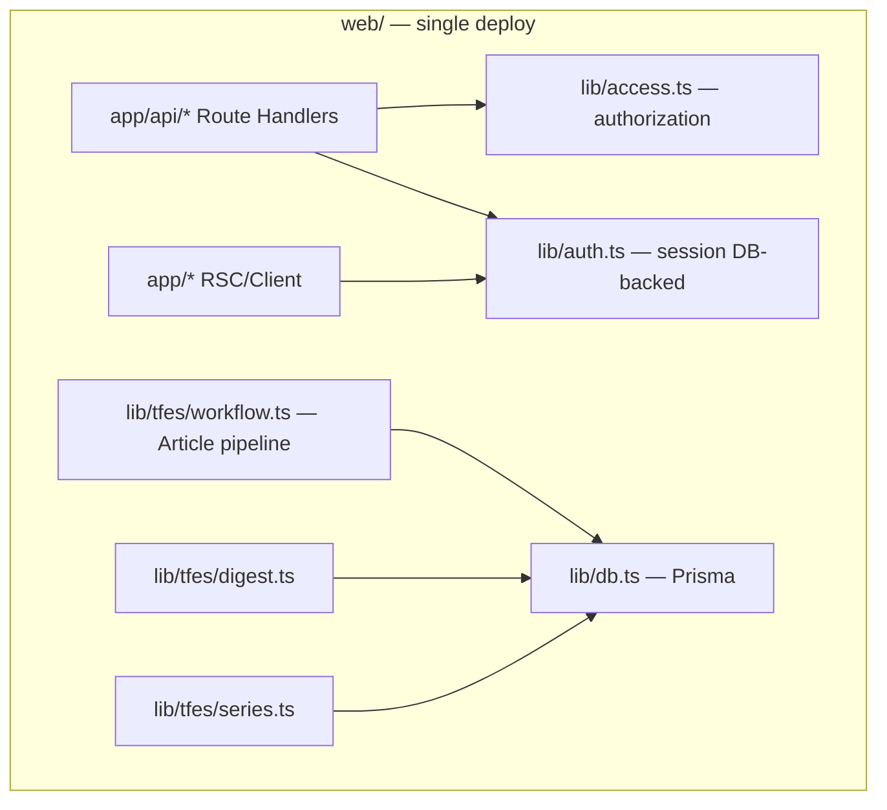

# Roadmap — ContentWrite Multi-user Readiness

> Cập nhật: 2026-08-07.
> Kiến trúc mục tiêu: **modular monolith** (Next.js `web/`), không microservice.

---

## Vision

Hỗ trợ nhiều editor, deploy ổn định, authorization nhất quán, pipeline AI-TFES tiếp tục chạy trên Vercel/serverless — **không** rewrite, **không** Kafka/Redis/K8s trừ khi có bằng chứng tải.

---

## Work Packages

| WP | Tên | Trạng thái | Phụ thuộc |
|----|-----|------------|-----------|
| **WP0-A** | Security & Multi-user Isolation (Phase A) | **Done** | — |
| **WP0-B** | Security Completion & Functional Quick Fixes | **Done** | WP0-A |
| **WP0-B (old plan)** | Security hardening (merged into WP0-B above) | — | — |
| **WP1** | Database & Deployment Safety | **Done** | — |
| **WP2** | Quality Gate & Vercel Compatibility | **Done** | WP0-A tests, WP1 |
| **WP2.5** | Revision Context & Token Reliability (F1–F3) | **Done** | WP2 |
| **WP2.6** | Final Gate & Parser Reliability | **Done — needs production validation** | WP2.5 |
| **WP2.7** | Production Validation & Measurement | **Implemented — cohort pending** | WP2.5, WP2.6 |
| **WP-V2-01** | Convergence KPI Telemetry | **Done — cohort pending** | WP2.7 |
| **WP-V2-02** | Best Candidate Lock | **Done — flag OFF** | WP-V2-01 |
| **WP-V2-03–05** | AI-TFES v2 RC1 guards/preserve/brake | **Done — Preview validation pending** | WP-V2-01, WP-V2-02 |
| **WP-PV2-01** | Prompt Architecture v2 priority trio | **Done — flag OFF; READY FOR RC2 PREVIEW** | AI-TFES v2 RC1 |
| **WP-E0A** | Editorial Trajectory Benchmark | **On hold until WP2.7 decision** | WP2.7 GO |
| **WP3-min** | Auto-write Reliability (decision-gated) | Proposed | Production metrics + auto-write demand |
| **WP4** | Performance Quick Wins | Planned | WP1 |
| **WP5** | Workflow Maintainability | Planned | WP2 |

Chi tiết từng WP: [work-packages/README.md](./work-packages/README.md)

---

## Timeline đề xuất (solo dev)

```
Q3 2026
├── WP0-A ✅ Security isolation
├── WP0-B ✅ Inactive session, temp password, tab fix
├── WP1 ✅    Migrations, remove db push from build
├── WP2 ✅    CI + Vercel build safety + Preview guards
├── WP2.5 ✅  Full review context + revision token/feedback
└── WP2.6 ✅  Final gate context + parser reliability

Q4 2026
├── WP2.7      Deployment SHA + telemetry + timeline + recovery + feedback
├── AI-TFES RC1 Convergence telemetry + candidate lock + Final guard + preserve + brake
├── RC1 Preview Four controlled trajectories, then bounded production canary
├── AI-TFES RC2 Prompt registry + Editorial Diagnosis + MINOR preserve + Lock Verifier
├── RC2 Preview Typed contracts, context reduction, Lock safety, v1.6 rollback
├── Cohort     5 clean + 3 exhausted + short/medium/long coverage
├── Decide     GO / HOLD / CANCEL-REDESIGN cho WP-E0A
├── Assurance Production DB/backup/Preview + observability
├── Product   Guided onboarding + measure completion/quality
├── WP3-min   Only if auto-write demand/metrics justify
├── WP4       Only measured hot paths
└── WP5       After workflow tests
```

---

## Post-WP2 decision gate

Post-implementation assessment: **7.0/10**, mức **MVP production cá nhân / Beta nhóm nhỏ**.

Thứ tự khuyến nghị:

1. Xác minh production migration, snapshot/restore và Preview DB isolation.
2. Thêm observability + metrics workflow tối thiểu.
3. Chạy một product loop: guided onboarding, đo completion/time-to-publish/editor score.
4. Chỉ làm WP3-min khi auto-write là promise cần giữ hoặc usage data chứng minh giá trị.

WP2.7 thêm sửa tay `draft12` khi exhausted nhưng cố ý giữ nguyên retry budget/counter và toàn bộ
state architecture. F7 (tách remediation budget) và F8 (mở lại Human Review/reset counter) vẫn
deferred cho tới khi cohort có evidence. WP-E0A không bắt đầu trước quyết định sau cohort.

Lý do: cron daily hiện chỉ tiến một workflow step; full WP3 trước khi biết mức sử dụng có nguy cơ over-engineering. Xem [post-wp2-assessment.md](./audit/post-wp2-assessment.md) và [next-step-recommendation.md](./next-step-recommendation.md).

---

## Kiến trúc mục tiêu (modular monolith)



**Single source of truth:** `Article.workflowState` (canonical); legacy `status`/`currentStep` là projection UI.

**Authorization:** tập trung tại `lib/access.ts`; API và SSR dùng `requireUser()` (DB-backed), không tin JWT role cho quyết định phân quyền.

**Ownership:** `createdById` trên Article, Digest, Series; legacy `null` → admin-only write.

---

## Điều kiện tách service sau này (chưa làm)

Chỉ xem xét worker riêng khi **đo được**:

1. LLM pipeline > 50% Vercel wall clock và block web requests
2. > 20 concurrent auto-write jobs/ngày cần resume độc lập
3. Cron daily không đủ; cần queue với retry cross-instance
4. Module deploy lifecycle thật sự tách (vd. image gen service)

---

## Liên kết

- [Project review](./audit/project-review.md)
- [Technical debt](./technical-debt.md)
- [Multi-user access model](./security/multi-user-access-model.md)
- [Changelog](./changelog.md)
