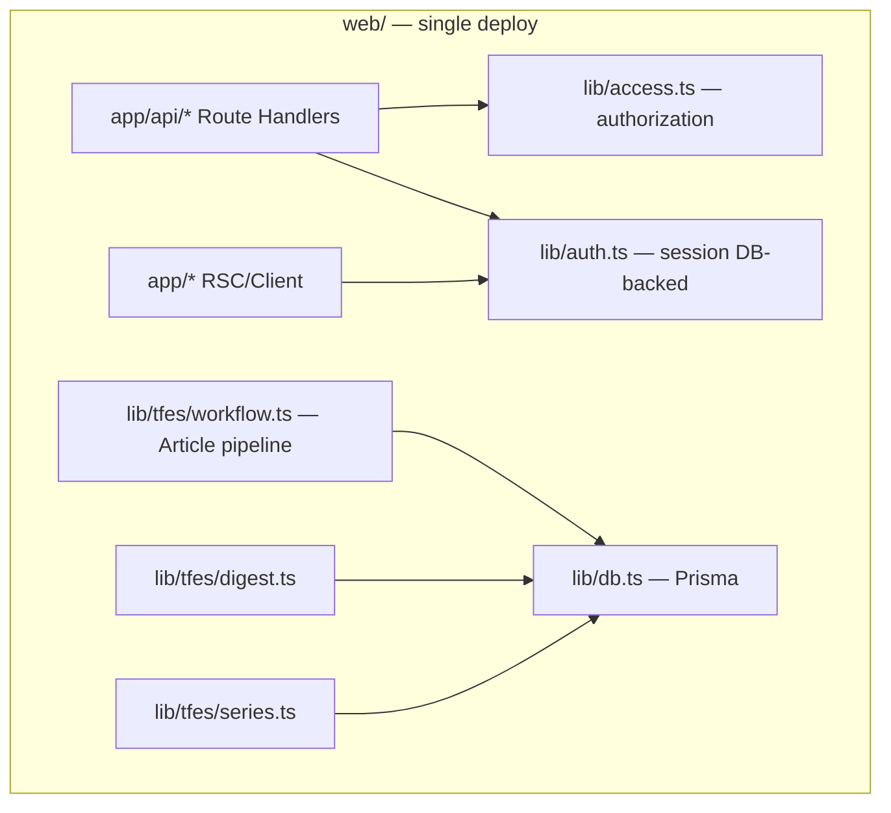

# Roadmap — ContentWrite Multi-user Readiness

> Cập nhật: 2026-08-06  
> Kiến trúc mục tiêu: **modular monolith** (Next.js `web/`), không microservice.

---

## Vision

Hỗ trợ nhiều editor, deploy ổn định, authorization nhất quán, pipeline AI-TFES tiếp tục chạy trên Vercel/serverless — **không** rewrite, **không** Kafka/Redis/K8s trừ khi có bằng chứng tải.

---

## Work Packages

| WP | Tên | Trạng thái | Phụ thuộc |
|----|-----|------------|-----------|
| **WP0-A** | Security & Multi-user Isolation (Phase A) | **Done** | — |
| **WP0-B** | Security Completion & Functional Quick Fixes | **Done** | WP0-A |
| **WP0-B (old plan)** | Security hardening (merged into WP0-B above) | — | — |
| **WP1** | Database & Deployment Safety | **Done** | — |
| **WP2** | Quality Gate & Vercel Compatibility | **Done** | WP0-A tests, WP1 |
| **WP3** | Auto-write Reliability | Planned | WP1 optional |
| **WP4** | Performance Quick Wins | Planned | WP1 |
| **WP5** | Workflow Maintainability | Planned | WP2 |

Chi tiết từng WP: [work-packages/README.md](./work-packages/README.md)

---

## Timeline đề xuất (solo dev)

```
Q3 2026
├── WP0-A ✅ Security isolation
├── WP0-B ✅ Inactive session, temp password, tab fix
├── WP1 ✅    Migrations, remove db push from build
└── WP2 ✅    CI + Vercel build safety + Preview guards

Q4 2026
├── WP3       Auto-write resume / cron alignment
├── WP4       Indexes + payload trim
└── WP5       Split workflow.ts (behavior-preserving)
```

---

## Kiến trúc mục tiêu (modular monolith)



**Single source of truth:** `Article.workflowState` (canonical); legacy `status`/`currentStep` là projection UI.

**Authorization:** tập trung tại `lib/access.ts`; API và SSR dùng `requireUser()` (DB-backed), không tin JWT role cho quyết định phân quyền.

**Ownership:** `createdById` trên Article, Digest, Series; legacy `null` → admin-only write.

---

## Điều kiện tách service sau này (chưa làm)

Chỉ xem xét worker riêng khi **đo được**:

1. LLM pipeline > 50% Vercel wall clock và block web requests
2. > 20 concurrent auto-write jobs/ngày cần resume độc lập
3. Cron daily không đủ; cần queue với retry cross-instance
4. Module deploy lifecycle thật sự tách (vd. image gen service)

---

## Liên kết

- [Project review](./audit/project-review.md)
- [Technical debt](./technical-debt.md)
- [Multi-user access model](./security/multi-user-access-model.md)
- [Changelog](./changelog.md)
