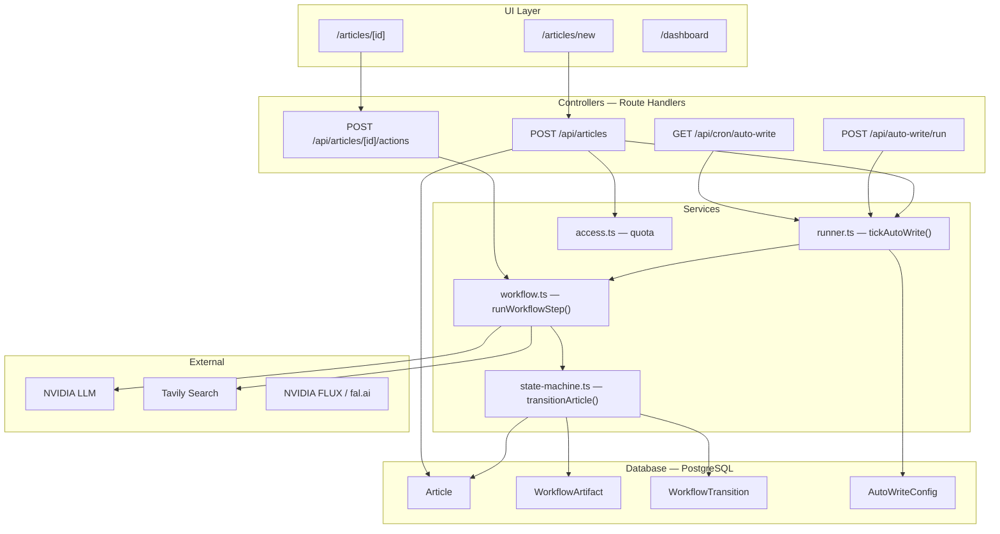
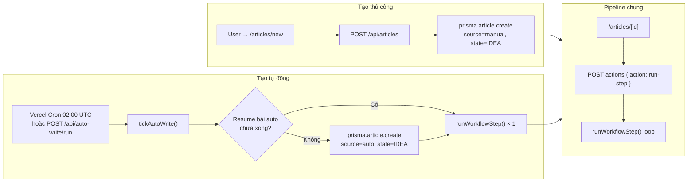
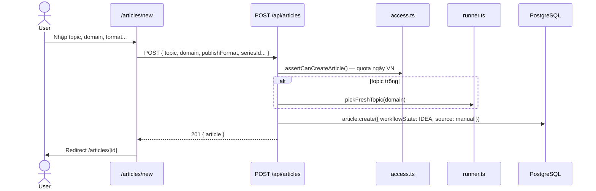
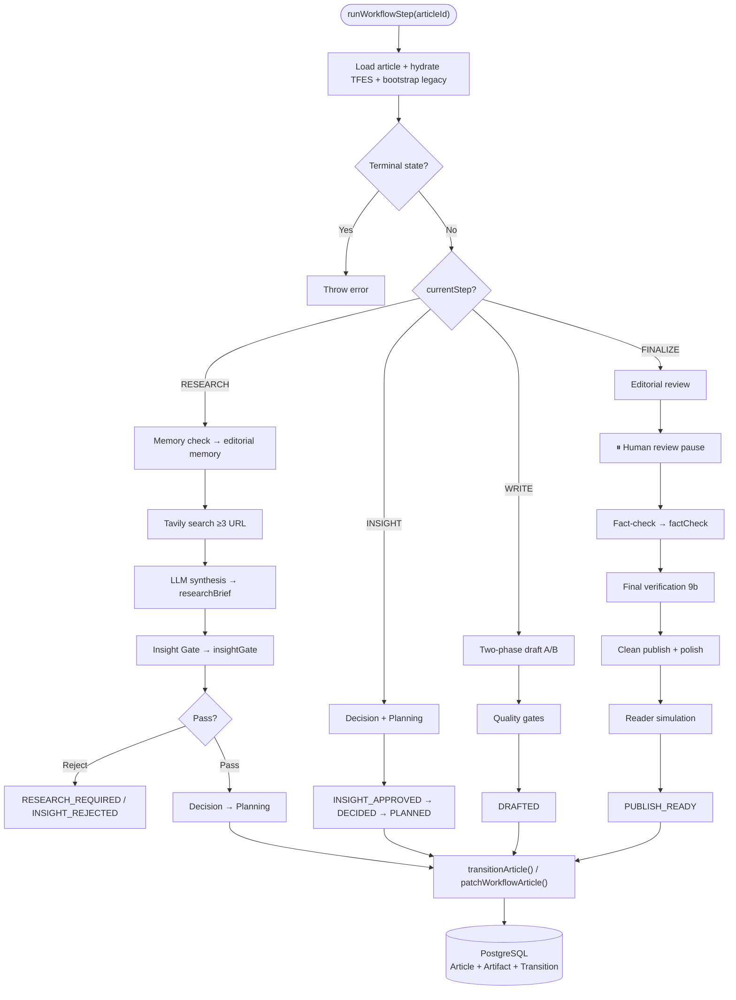
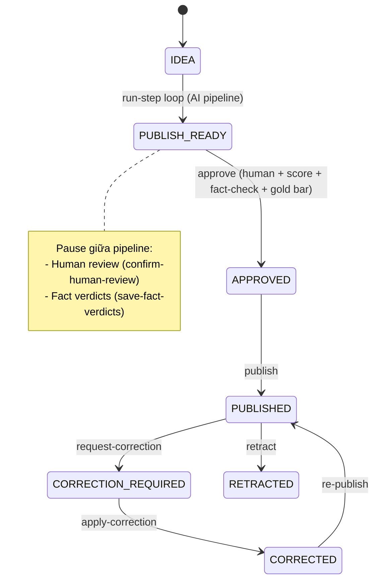
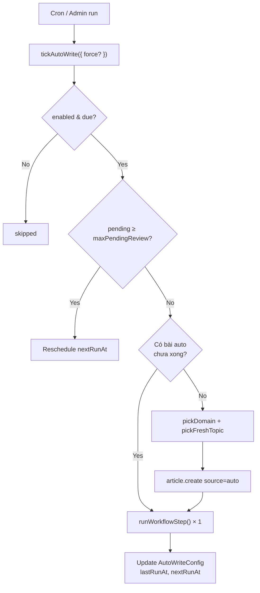

# Luồng tạo bài viết (Article Creation Workflow)

> Tài liệu mô tả toàn bộ workflow tạo bài viết trong ContentWrite / AI-TFES.  
> Cập nhật: 2026-08-06

Xem thêm kiến trúc tổng thể: [architecture.md](../architecture.md)

---

## 1. Kiến trúc tổng quan

Hệ thống là **Next.js 16 monorepo**, deploy từ thư mục `web/`. Không có MVC truyền thống — **Route Handlers** đóng vai controller, **Prisma** gọi trực tiếp (không có repository layer).



**Nguyên tắc thiết kế quan trọng:** Mỗi HTTP request chỉ chạy **đúng 1** `runWorkflowStep()` (giới hạn Vercel `maxDuration=300s`). UI hoặc cron loop bên ngoài để chạy hết pipeline.

---

## 2. Controller (Route Handlers)

Trong Next.js App Router, mỗi `route.ts` là một controller.

### 2.1 API chính — tạo & chạy pipeline

| Endpoint | File | Vai trò |
|----------|------|---------|
| `POST /api/articles` | `web/src/app/api/articles/route.ts` | **Tạo bài thủ công** |
| `GET /api/articles` | cùng file | Liệt kê bài + quota |
| `POST /api/articles/[id]/actions` | `web/src/app/api/articles/[id]/actions/route.ts` | **Điều khiển pipeline** |
| `GET/PATCH/DELETE /api/articles/[id]` | `web/src/app/api/articles/[id]/route.ts` | CRUD metadata |
| `GET /api/articles/[id]/workflow` | `web/src/app/api/articles/[id]/workflow/route.ts` | Audit transitions + artifacts |
| `POST /api/articles/[id]/hero` | `web/src/app/api/articles/[id]/hero/route.ts` | Tạo hero/gallery image |

### 2.2 API auto-write (tạo bài tự động)

| Endpoint | File | Vai trò |
|----------|------|---------|
| `GET /api/cron/auto-write` | `web/src/app/api/cron/auto-write/route.ts` | Vercel Cron 02:00 UTC |
| `POST /api/auto-write/run` | `web/src/app/api/auto-write/run/route.ts` | Admin "Chạy ngay" |
| `POST /api/auto-write/tick` | `web/src/app/api/auto-write/tick/route.ts` | Tick khi mở app |
| `GET/PUT /api/settings/auto-write` | `web/src/app/api/settings/auto-write/route.ts` | Cấu hình lịch |

Cron config: `web/vercel.json` → `"0 2 * * *"` trên `/api/cron/auto-write`.

### 2.3 API hỗ trợ (trước/sau khi tạo)

| Endpoint | File | Vai trò |
|----------|------|---------|
| `GET /api/editorial-memory` | `web/src/app/api/editorial-memory/route.ts` | Gợi ý tránh trùng chủ đề |
| `GET/PUT /api/settings/article-shapes` | `web/src/app/api/settings/article-shapes/route.ts` | Cấu trúc bài (shape) |
| `GET /api/settings/suggest-seeds` | `web/src/app/api/settings/suggest-seeds/route.ts` | Gợi ý seed topic |
| `GET/POST /api/series` | `web/src/app/api/series/route.ts` | Gán series khi tạo |
| `GET /api/health/integrations` | `web/src/app/api/health/integrations/route.ts` | Health LLM |
| `GET /api/health/tavily` | `web/src/app/api/health/tavily/route.ts` | Health Tavily |

### 2.4 UI Pages (entry point người dùng)

| Page | File |
|------|------|
| Form tạo bài | `web/src/app/articles/new/page.tsx` |
| Pipeline + approve/publish | `web/src/app/articles/[id]/page.tsx` |
| Editorial queue | `web/src/app/dashboard/page.tsx` |

### 2.5 UI Components liên quan pipeline

| Component | File |
|-----------|------|
| Pipeline run panel | `web/src/components/pipeline-run-panel.tsx` |
| Pipeline steps (4 bước) | `web/src/components/pipeline-steps.tsx` |
| Editorial queue | `web/src/components/pipeline-queue.tsx` |
| Human review gate | `web/src/components/human-review-gate.tsx` |
| Approve gate | `web/src/components/approve-gate.tsx` |
| Fact ledger panel | `web/src/components/fact-ledger-panel.tsx` |
| Clean edit panel | `web/src/components/clean-edit-panel.tsx` |
| Article image studio | `web/src/components/article-image-studio.tsx` |
| Memory hints | `web/src/components/memory-hints.tsx` |

---

## 3. Service Layer

### 3.1 Orchestrator chính — `web/src/lib/tfes/workflow.ts`

| Hàm | Vai trò |
|-----|---------|
| `runWorkflowStep(articleId)` | Chạy **1 micro-step** pipeline (research → insight → write → finalize) |
| `resetWorkflow(articleId)` | Reset về `IDEA`, tạo `workflowRunId` mới |
| `confirmHumanReview(...)` | Xác nhận sau pause human review |
| `approveArticle(...)` | Gate duyệt → `APPROVED` + tạo `KnowledgeRecord` |
| `publishArticle(...)` | `APPROVED` → `PUBLISHED` |
| `polishFromHumanEdits(...)` | AI polish sau chỉnh sửa thủ công |
| `saveFactHumanVerdicts(...)` | Verdict fact-check từ biên tập viên |
| `requestCorrection` / `applyCorrection` / `retractArticle` | Vòng đời sau publish |

### 3.2 State machine — `web/src/lib/tfes/state-machine.ts`

| Hàm | Vai trò |
|-----|---------|
| `transitionArticle(...)` | Chuyển trạng thái atomic + ghi artifact + transition log |
| `patchWorkflowArticle(...)` | Cập nhật cùng state (vd. chọn topic) |
| `resetWorkflowArticle(...)` | Full reset workflow |
| `assertTransitionAllowed(from, to)` | Rule AI-TFES v1.6 |
| `deriveLegacyProjection(state)` | Map canonical state → UI 4 bước |
| `bootstrapLegacyWorkflowState(...)` | Migrate bài cũ |

Optimistic locking qua `workflowVersion` — mỗi mutation tăng version.

### 3.3 Auto-write — `web/src/lib/auto-write/`

| File / Hàm | Vai trò |
|------------|---------|
| `runner.ts` → `tickAutoWrite()` | Resume hoặc tạo bài `source: "auto"`, chạy 1 step |
| `runner.ts` → `pickFreshTopic()` | Chọn topic không trùng |
| `runner.ts` → `getAutoWriteConfig()` | Singleton config (`id=default`) |
| `runner.ts` → `runFullWorkflowToReview()` | Loop tối đa 24 steps (legacy helper) |
| `schedule.ts` | Lịch `nextRunAt`, timezone VN |
| `topic-dedupe.ts` | Dedup topic/title |
| `suggest-seeds.ts` | Gợi ý seed |

### 3.4 Service hỗ trợ pipeline

| Module | File | Vai trò |
|--------|------|---------|
| Prompts | `prompts.ts` | Ghép system prompt AI-TFES |
| Parser | `parser.ts` | Parse marker AI (WRITE_DONE, REVIEW_DONE…) |
| Quality gates | `quality.ts`, `engineering-gold-bar.ts` | Gate chất lượng draft |
| Fact-check | `fact-ledger.ts` | Claim parsing + remediation |
| Human review | `human-review.ts` | Pause/ack human review |
| Editorial review | `editorial-review-gate.ts` | Gate editorial |
| Final verification | `final-verification.ts` | Bước 9b |
| Editorial memory | `editorial-memory.ts` | Hint từ bài publish tốt |
| Article shapes | `article-shape-manager.ts`, `article-shapes.ts` | Cấu trúc bài |
| Research evidence | `research-evidence.ts` | Audit research brief |
| Desk state | `desk-state.ts` | `deskJson` verdicts |
| Contract / config | `contract.ts`, `pipeline-config.ts`, `retry-policy.ts` | Version, ngưỡng, retry |
| Publish formats | `publish-formats.ts` | blog, field-note, adr, postmortem… |
| Writing prefs | `writing-prefs.ts` | Target word count, avoid formats |
| Domains | `domains.ts`, `domain-profile.ts` | Domain profiles |
| TFES docs | `tfes-docs.ts` | DB override prompt |
| Tracker | `tracker.ts` | Micro-step labels cho UI |
| Access/quota | `access.ts` | `assertCanCreateArticle()` — quota ngày VN |

### 3.5 Tích hợp ngoài

| Service | File | Env |
|---------|------|-----|
| LLM | `web/src/lib/nvidia.ts` | `NVIDIA_API_KEY`, `NVIDIA_MODEL`, `NVIDIA_BASE_URL` |
| Web search | `web/src/lib/search.ts` | `TAVILY_API_KEY` |
| Hero image | `web/src/lib/image/hero.ts` | `NVIDIA_API_KEY`, `FAL_KEY` |
| Gallery | `web/src/lib/image/gallery.ts` | — |
| Publish content | `web/src/lib/publish-content.ts` | Sanitize reader-facing content |

Prompt templates: `AI-TFES/` (authoring) → sync build-time sang `web/content/ai-tfes/`; runtime có thể override qua `TfesDocument` (DB).

---

## 4. Repository / Data Access

**Không có repository pattern.** Mọi truy cập DB đi qua Prisma client tại `web/src/lib/db.ts`, gọi trực tiếp từ route handlers và services.

Các thao tác chính:

- `prisma.article.create` / `findUnique` / `update` / `findMany`
- `prisma.workflowArtifact.create` (append-only, không update)
- `prisma.workflowTransition.create` (audit log)
- `prisma.autoWriteConfig.findUnique` / `update`
- `prisma.series.findUnique`
- `prisma.knowledgeRecord.create` (khi approve)

---

## 5. Database (PostgreSQL + Prisma)

Schema: `web/prisma/schema.prisma`

### 5.1 Bảng chính liên quan tạo bài

| Model | Vai trò |
|-------|---------|
| **`Article`** | Entity trung tâm — topic, workflow state, nội dung pipeline |
| **`WorkflowArtifact`** | Artifact bất biến (research brief, draft, review, fact-check…) |
| **`WorkflowTransition`** | Log chuyển trạng thái append-only |
| **`KnowledgeRecord`** | Tạo khi approve — dùng cho editorial memory |
| **`AutoWriteConfig`** | Singleton (`id=default`) — lịch auto-write |
| **`ArticleShapeProfile`** | Policy cấu trúc bài |
| **`TfesDocument`** | Override prompt AI-TFES runtime |
| **`Series`** | Nhóm bài (optional) |
| **`User`** | Creator, approver, quota `dailyArticleLimit` |

### 5.2 Cột quan trọng trên `Article`

| Nhóm | Cột |
|------|-----|
| Identity | `topic`, `domain`, `title`, `source` (`manual` / `auto`) |
| Workflow | `workflowState`, `workflowRunId`, `workflowVersion`, `status`, `currentStep` |
| Nội dung pipeline | `researchBrief`, `insightGate`, `draft12`, `factCheck`, `cleanPublish`, `knowledgeRecord` |
| Human desk | `deskJson`, `reviewerNotes`, `approvedById`, `approvedAt`, `publishedAt` |
| Media | `heroImageUrl`, `galleryJson`, `heroBrief` |
| Config bài | `publishFormat`, `articleShapeId`, `targetWordCount`, `avoidFormats`, `seriesId` |

### 5.3 Enum `WorkflowState` (canonical AI-TFES v1.6)

**Happy path:**

```
IDEA → MEMORY_CHECKED → RESEARCHED → SYNTHESIZED → INSIGHT_APPROVED
  → DECIDED → PLANNED → DRAFTED → EDITORIAL_REVIEWED → FACT_CHECKED
  → FINAL_REVIEWED → POLISHED → READER_SIMULATED → PUBLISH_READY
  → APPROVED → PUBLISHED
```

**Nhánh lỗi / revision:**

- `RESEARCH_REQUIRED`, `INSIGHT_REJECTED`
- `MINOR_REVISION_REQUIRED`, `MAJOR_REVISION_REQUIRED`, `REWRITE_REQUIRED`
- `FACT_CHECK_FAILED`, `READER_SIMULATION_FAILED`
- Post-publish: `CORRECTION_REQUIRED`, `CORRECTED`, `RETRACTED`

Rule chuyển trạng thái: `ALLOWED` map trong `web/src/lib/tfes/state-machine.ts`.

### 5.4 Migrations / SQL patches

| File | Nội dung |
|------|----------|
| `web/prisma/schema.prisma` | Source of truth |
| `web/prisma/sql/20260804_tfes_v16_workflow.sql` | WorkflowState, Artifact, Transition |
| `web/prisma/sql/20260804_add_workflow_version.sql` | Optimistic lock |
| `web/prisma/sql/20260804_tfes_lifecycle_contract.sql` | Lifecycle contract fields |
| `web/prisma/sql/20260804_article_shape_manager.sql` | ArticleShapeProfile |
| `web/prisma/sql/20260801_add_article_desk_json.sql` | `deskJson` column |
| `web/prisma/sql/20260801_add_article_gallery_json.sql` | `galleryJson` column |
| `web/prisma/migrations/manual_users_quota.sql` | Quota user |
| `web/prisma/migrations/manual_writing_prefs.sql` | Writing prefs columns |
| `web/prisma/migrations/manual_tfes_documents.sql` | TfesDocument table |

---

## 6. Workflow đầy đủ

### 6.1 Hai đường vào (Entry Points)



### 6.2 Luồng tạo bài thủ công (sequence)



**Logic trong `POST /api/articles`:**

1. `requireUser()` + `assertCanCreateArticle()` (quota theo TZ VN)
2. Resolve `domain`, `publishFormat`, writing prefs
3. Nếu topic trống → `pickFreshTopic()` từ seed config
4. Optional: gán `seriesId` + `seriesOrder`
5. `prisma.article.create({ workflowState: IDEA, source: "manual", ... })`

File: `web/src/app/api/articles/route.ts`

### 6.3 Luồng pipeline — `runWorkflowStep()` (4 phase UI)



**Chi tiết từng phase trong `runWorkflowStep`:**

| Phase UI | Micro-steps | External calls |
|----------|-------------|----------------|
| **RESEARCH** | Memory check → Tavily (3 queries, ≥3 URL) → LLM synthesis → Insight Gate | Tavily, NVIDIA |
| **INSIGHT** | Decision → Planning | NVIDIA |
| **WRITE** | Two-phase draft A/B → quality gates | NVIDIA |
| **FINALIZE** | Editorial review → human review pause → fact-check → 9b → clean publish → polish → reader sim | NVIDIA |

Mỗi bước thành công ghi:
- Cột tương ứng trên `Article` (vd. `researchBrief`, `draft12`)
- Row mới trên `WorkflowArtifact` (immutable)
- Row mới trên `WorkflowTransition` (audit)

### 6.4 Actions API — dispatch sau khi tạo

File: `web/src/app/api/articles/[id]/actions/route.ts`

| `action` | Service function |
|----------|------------------|
| `run-step` | `runWorkflowStep(id)` |
| `reset` | `resetWorkflow(id)` |
| `confirm-human-review` | `confirmHumanReview(id, …)` |
| `polish-human-edits` | `polishFromHumanEdits(id, …)` |
| `save-fact-verdicts` | `saveFactHumanVerdicts(id, …)` |
| `approve` | `approveArticle(id, userId, …)` |
| `publish` | `publishArticle(id)` |
| `request-correction` | `requestCorrection(id, …)` |
| `apply-correction` | `applyCorrection(id, …)` |
| `retract` | `retractArticle(id, …)` |

`maxDuration = 300` (Vercel Hobby limit).

### 6.5 Human gates & publish



**Sau publish:**

- Tạo `KnowledgeRecord` (editorial memory cho bài sau)
- Bài điểm cao có thể vào gold sample (`engineering-gold-bar.ts`)

### 6.6 Auto-write tick



**Điều kiện dừng auto pipeline** (`isAutoWorkflowDone`):

- Terminal state (`PUBLISH_READY`, `APPROVED`, `PUBLISHED`, …)
- Đang chờ human review
- `INSIGHT_REJECTED`
- Retry exhausted (fact-check, revision, final verification)

**Background jobs:** Không có Redis/Bull/queue. Scheduling hoàn toàn Vercel-native (cron + client loop).

---

## 7. Map UI legacy ↔ Canonical state

UI hiển thị **4 bước** (projection từ `deriveLegacyProjection`):

| UI Step | Canonical states (rút gọn) |
|---------|---------------------------|
| **RESEARCH** | `IDEA` → `MEMORY_CHECKED` → `RESEARCHED` → `SYNTHESIZED` |
| **INSIGHT** | `INSIGHT_APPROVED` → `DECIDED` → `PLANNED` |
| **WRITE** | `DRAFTED` (+ revision states) |
| **FINALIZE** | `EDITORIAL_REVIEWED` → `FACT_CHECKED` → `FINAL_REVIEWED` → `POLISHED` → `READER_SIMULATED` → `PUBLISH_READY` |

Legacy `status` / `currentStep` trên `Article` là projection UI; **`workflowState` là source of truth**.

---

## 8. Luồng request HTTP

```
Browser → middleware.ts (JWT, trừ /login, auth API, health, cron)
       → Page (RSC/Client) hoặc API route
       → lib/* (workflow, db, nvidia, search)
       → PostgreSQL (Prisma)
```

Route public (không cần JWT): `/login`, `/api/auth/login`, `/api/health/integrations`, `/api/cron/auto-write`.

---

## 9. Tóm tắt nhanh

| Layer | Thực tế trong codebase |
|-------|------------------------|
| **Controller** | 24 Route Handlers trong `web/src/app/api/**/route.ts` |
| **Service** | `web/src/lib/tfes/*` (pipeline) + `web/src/lib/auto-write/*` (scheduled) |
| **Repository** | **Không có** — Prisma trực tiếp qua `web/src/lib/db.ts` |
| **Database** | PostgreSQL — models `Article`, `WorkflowArtifact`, `WorkflowTransition`, … |
| **API tạo bài** | `POST /api/articles` (manual) + cron `/api/cron/auto-write` (auto) |
| **API chạy pipeline** | `POST /api/articles/[id]/actions` với `action: "run-step"` |
| **Background job** | Không có queue — Vercel Cron + client loop, 1 step/request |

**Luồng cốt lõi:**

```
Tạo Article (IDEA)
  → loop runWorkflowStep (Tavily + NVIDIA LLM + quality gates)
  → PUBLISH_READY
  → approveArticle (human)
  → publishArticle
  → PUBLISHED (+ KnowledgeRecord cho editorial memory)
```

---

## 10. Tham chiếu nhanh

| Câu hỏi | Nơi xem |
|---------|---------|
| Kiến trúc tổng thể | [docs/architecture.md](../architecture.md) |
| State machine rules | `web/src/lib/tfes/state-machine.ts`, `AI-TFES/05-Templates/Workflow-State-Machine.md` |
| Orchestrator pipeline | `web/src/lib/tfes/workflow.ts` |
| Auto-write runner | `web/src/lib/auto-write/runner.ts` |
| Prisma schema | `web/prisma/schema.prisma` |
| Chuẩn AI-TFES | `AI-TFES/00-README.md` |
